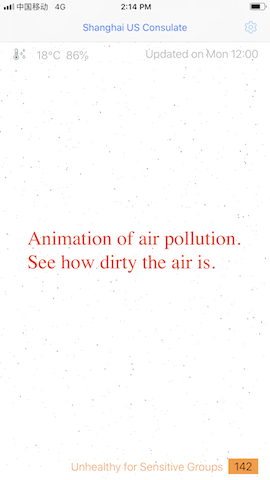
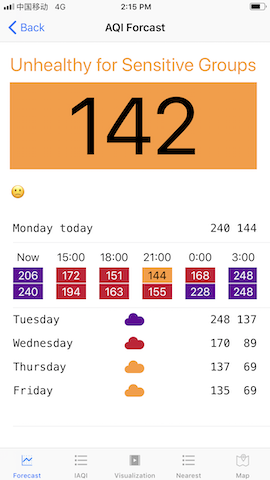
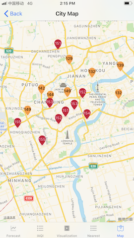

## About the App

to visualize pollution with animation of particulate matter in the air; free iOS App; ad-free; no registration required.

## Key Features
- ✅ **Visualize Air Pollution**: animation demo particulate matter in the air.

## Other Features
- ✅ **Air Pollution Alert**: push notification to you when the air quality worsens.
- ✅ **Pollution Map**: show the AQI of nearby stations on the map.
- ✅ **Air Quality forecast**: provide Air Quality forecast up to 8 days.

## Data Source
All data provided by the [World Air Quality Index Project](https://waqi.info).

## Screen Shots

         

         

## Contact
If you have any questions please contact [Deng junqiang](mailto:sh109419@163.com).

